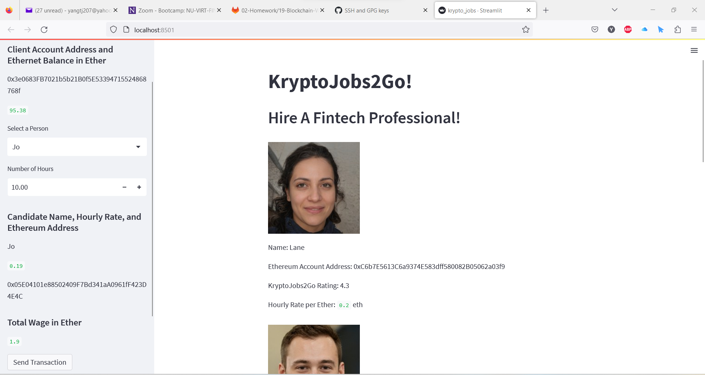
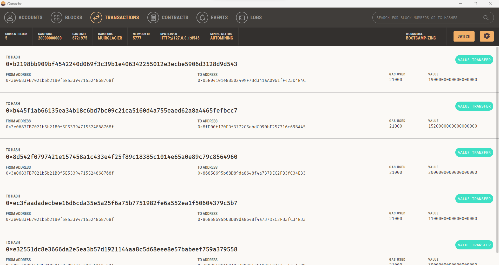
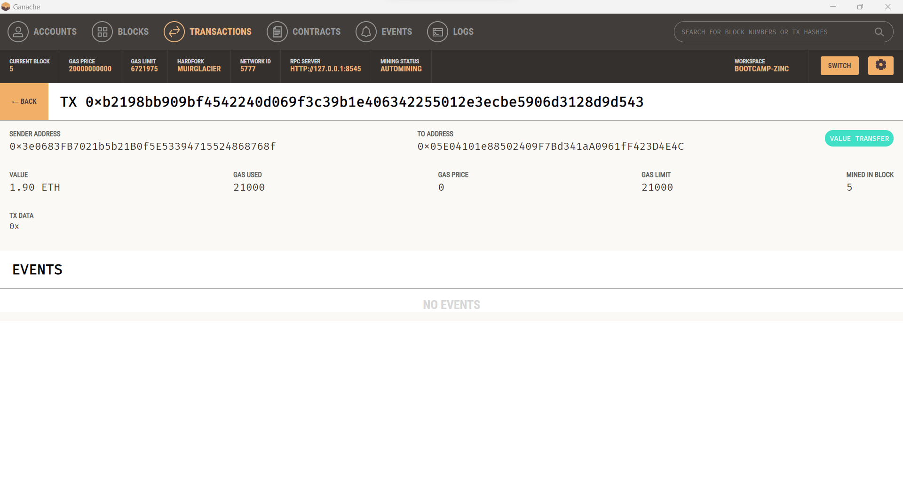
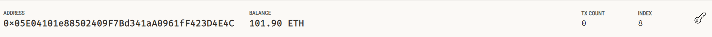

# Cryptocurrency Wallet

In this project, we build an application called KryptoJobs2Go. The customers can use the application to find fintech professionals from among a list of candidates.

After launching the KryptoJobs2Go application through `streamlit run krypto_jobs.py`, we see there are four fintech professionals available to be hired. Their Ethereum account addresses, KryptoJobs2Go ratings, hourly rates per Ether are also shown.

We decided to hire Jo for 10 hours. The total wage is 1.9 Ether. After clicking the "Send Transaction" button, we see transaction details in Ganache.

The balance of Jo's account is increased by 1.9 Ether after this transaction:

